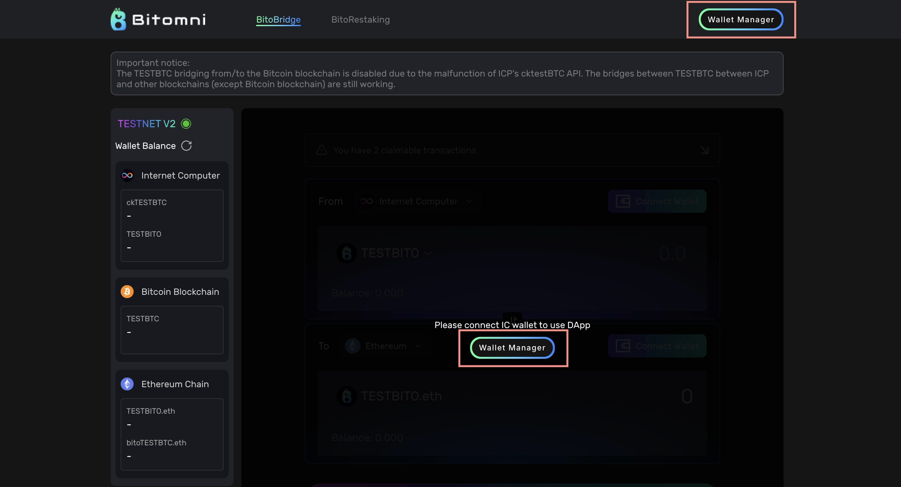

# Wallet Manager

The Wallet Manager handles all supported and connected wallets for users. If you haven’t connected your ICP wallets yet, you can do so using either of the two 'Wallet Manager' buttons, as shown in the image below.

<figure><figcaption>
Without an connected ICP wallet
</figcaption></figure>

By clicking the "Wallet Manager" button, you can view all the supported and connected wallets.

<figure><figcaption>
Supported wallets
</figcaption></figure>

After connecting your wallet, a ‘flashing green dot’ indicator will appear, as shown in the image below.

<figure><figcaption>
Connected wallets
</figcaption></figure>
